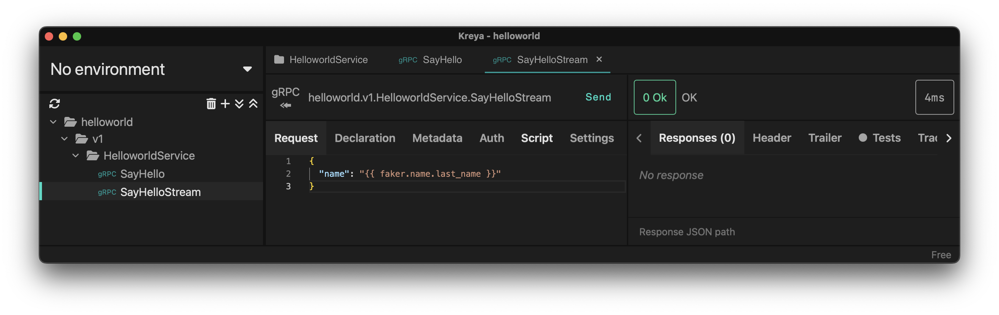

# Repository for reproduce error in stream

```ts
  @GrpcMethod('HelloworldService', 'SayHelloStream')
  sayHelloStream() {
    throw new Error('Method not implemented');
  }
```

NestJS >= 10.2.9 ignoring error and client doesn't see it in stream method:



**(Expected behavior)** Nest <= 10.2.8 client see the error in stream method:


